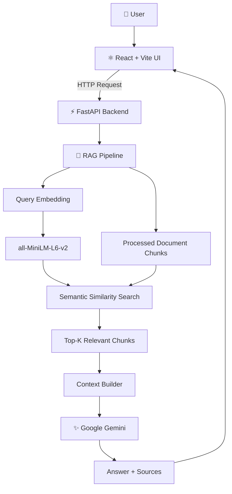
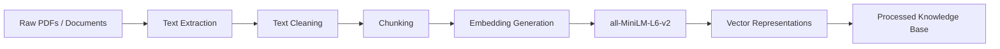
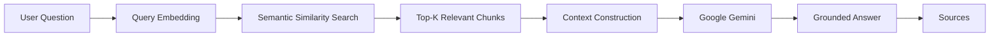

<div align="center">

# 🌿 AyurIP-Sahayak

### AI-Powered RAG Assistant for Ayurveda, Traditional Knowledge & Intellectual Property Research

**Retrieve first → Generate second.**

[](https://www.python.org/)
[](https://fastapi.tiangolo.com/)
[](https://react.dev/)
[](https://vitejs.dev/)
[]()
[]()

</div>

---

## ✨ What is AyurIP-Sahayak?

**AyurIP-Sahayak** is a full-stack AI application that uses **Retrieval-Augmented Generation (RAG)** to make information discovery across **Ayurveda, Traditional Knowledge (TK), and Intellectual Property Rights (IPR)** documents easier.

Instead of sending a question directly to an LLM, the application first searches its own document knowledge base using **semantic embeddings**, retrieves relevant document chunks, builds contextual information, and then sends that context to **Google Gemini** to generate a natural-language answer.

```text
User Question
      ↓
Query Embedding
      ↓
Semantic Search
      ↓
Relevant Document Chunks
      ↓
Context Construction
      ↓
Google Gemini
      ↓
Answer + Sources
```

> **The key idea:** the application searches its own knowledge base first and then uses AI to explain the retrieved information.

---

# 🎯 Why I Built This

Information related to Ayurveda, Traditional Knowledge and IPR is often spread across lengthy documents.

This creates practical problems:

* Large documents can be difficult to search manually.
* Keyword search may fail when the same concept is expressed differently.
* Important information can be buried inside long documents.
* A general-purpose LLM may not have access to the project's specific documents.
* Users need a simpler way to interact with domain-specific information.

AyurIP-Sahayak explores how **RAG can be used to solve this problem**.

---

# 🧠 Core Concept

The project is intentionally **not** just:

```text
React → Gemini API → Answer
```

Instead, it implements a complete RAG workflow:

```text
                    ┌──────────────────────┐
                    │       Documents      │
                    └──────────┬───────────┘
                               ↓
                    ┌──────────────────────┐
                    │   Text Extraction    │
                    └──────────┬───────────┘
                               ↓
                    ┌──────────────────────┐
                    │      Chunking        │
                    └──────────┬───────────┘
                               ↓
                    ┌──────────────────────┐
                    │     Embeddings       │
                    └──────────┬───────────┘
                               ↓
                    ┌──────────────────────┐
                    │ Semantic Retrieval   │
                    └──────────┬───────────┘
                               ↓
                    ┌──────────────────────┐
                    │ Context Construction │
                    └──────────┬───────────┘
                               ↓
                    ┌──────────────────────┐
                    │    Google Gemini     │
                    └──────────┬───────────┘
                               ↓
                    ┌──────────────────────┐
                    │   Answer + Sources   │
                    └──────────────────────┘
```

This separation demonstrates the difference between **retrieval** and **generation**.

---

# 🏗️ System Architecture



---

# 🔄 How the RAG Pipeline Works

## 1. Offline / Indexing Pipeline

Documents are prepared before users start asking questions.



This is the **offline/indexing side** of the system.

---

## 2. Online / Query Pipeline

When a user asks a question:



This is the **runtime/query side** of the RAG system.

---

# 🔎 Semantic Retrieval

The project uses:

* **sentence-transformers**
* **all-MiniLM-L6-v2**
* **NumPy**

The embedding model converts both document chunks and user queries into numerical vectors.

Example:

```text
"What is Traditional Knowledge?"
              ↓
       Embedding Model
              ↓
[0.021, -0.182, 0.441, ...]
```

The same embedding model is used for:

* Document chunks
* User queries

This allows both to be compared in the same vector space.

### Retrieval flow

```text
Query
 ↓
Query Vector
 ↓
Compare with Document Vectors
 ↓
Calculate Similarity
 ↓
Sort by Similarity
 ↓
Select Top-K
```

The current retrieval implementation uses **normalized embeddings** with **dot-product similarity**.

Because the vectors are normalized, the dot product corresponds to **cosine similarity**.

### Current default

```text
top_k = 5
```

Retrieved information includes:

* Similarity score
* Chunk ID
* Source
* Chunk text

---

# 🤖 Generation Layer

Google Gemini is responsible for the generation stage.

The architecture deliberately keeps the two responsibilities separate:

```text
Retrieval
   ↓
Find relevant information

Generation
   ↓
Explain the retrieved information
```

This makes the system modular and allows the retrieval and generation components to evolve independently.

---

# 💻 Technology Stack

| Layer       | Technology            | Purpose                      |
| ----------- | --------------------- | ---------------------------- |
| Frontend    | React                 | Interactive user interface   |
| Frontend    | Vite                  | Development/build tooling    |
| Frontend    | JavaScript            | Application logic            |
| Frontend    | CSS                   | Styling                      |
| Backend     | Python                | Backend & RAG implementation |
| Backend     | FastAPI               | REST API layer               |
| Backend     | Uvicorn               | ASGI server                  |
| AI / RAG    | sentence-transformers | Text embeddings              |
| AI / RAG    | all-MiniLM-L6-v2      | Embedding model              |
| AI / RAG    | NumPy                 | Vector operations            |
| AI / RAG    | Google Gemini API     | LLM generation               |
| Documents   | pypdf                 | PDF text extraction          |
| Development | Git / GitHub          | Version control              |
| Development | VS Code               | Development environment      |

---

# 📁 Project Structure

```text
AyurIP-Sahayak/
│
├── backend/
│   │
│   ├── app/
│   │   └── main.py
│   │
│   ├── rag/
│   │   ├── ingestion/
│   │   │
│   │   ├── retrieval/
│   │   │   ├── retrieval.py
│   │   │   └── retriever.py
│   │   │
│   │   ├── generation/
│   │   │
│   │   └── rag_pipeline.py
│   │
│   ├── data/
│   │   ├── raw/
│   │   └── processed/
│   │
│   ├── requirements.txt
│   └── .env
│
├── frontend/
│   │
│   ├── src/
│   │   ├── App.jsx
│   │   ├── App.css
│   │   ├── index.css
│   │   └── main.jsx
│   │
│   ├── public/
│   ├── package.json
│   └── vite.config.js
│
└── README.md
```

### Backend

* `app/` — FastAPI application entry point.
* `rag/ingestion/` — document preparation and indexing.
* `rag/retrieval/` — semantic retrieval logic.
* `rag/generation/` — LLM generation layer.
* `rag/rag_pipeline.py` — connects retrieval and generation.
* `data/raw/` — source documents.
* `data/processed/` — processed knowledge-base data.

### Frontend

The React application provides the interface for:

* Entering questions
* Sending requests to the backend
* Displaying generated answers
* Displaying source information

---

# 🔌 API Layer

FastAPI acts as the bridge between the frontend and the RAG system.

```text
React
  │
  │ HTTP
  ▼
FastAPI
  │
  ▼
RAG Pipeline
  ├── Retrieval
  └── Gemini Generation
  │
  ▼
FastAPI Response
  │
  ▼
React
```

FastAPI also provides automatic interactive API documentation at:

```text
/docs
```

> Endpoint names are intentionally not listed here unless verified directly from `backend/app/main.py`.

---

# ⚙️ Getting Started

## Prerequisites

Make sure the following are installed:

* Python 3.x
* Node.js
* npm
* Git
* Google Gemini API key

---

## 1. Clone the Repository

```bash
git clone <your-repository-url>
cd AyurIP-Sahayak
```

---

## 2. Create a Python Virtual Environment

```bash
python -m venv .venv
```

### Windows

```powershell
.venv\Scripts\activate
```

### macOS / Linux

```bash
source .venv/bin/activate
```

---

## 3. Install Backend Dependencies

```bash
cd backend
pip install -r requirements.txt
```

---

## 4. Configure Environment Variables

Create:

```text
backend/.env
```

Add:

```env
GEMINI_API_KEY=your_api_key_here
```

### 🔐 Security

**Never expose your Gemini API key in frontend code or commit it to GitHub.**

Add `.env` to `.gitignore`:

```gitignore
.env
.venv/
__pycache__/
node_modules/
```

---

## 5. Install Frontend Dependencies

Open another terminal:

```bash
cd frontend
npm install
```

---

# ▶️ Running the Application

## Start the Backend

From `backend/`:

```bash
uvicorn app.main:app --reload
```

FastAPI documentation:

```text
http://127.0.0.1:8000/docs
```

---

## Start the Frontend

From `frontend/`:

```bash
npm run dev
```

Vite will display the local development URL in the terminal.

---

# 💬 Example User Journey

Suppose a user asks:

> **"What is TKDL?"**

The application processes it like this:

```text
👤 User
   │
   ▼
"What is TKDL?"
   │
   ▼
⚛️ React UI
   │
   ▼
⚡ FastAPI
   │
   ▼
🔢 Query Embedding
   │
   ▼
🔎 Semantic Search
   │
   ▼
📚 Top Relevant Document Chunks
   │
   ▼
🧩 Context Construction
   │
   ▼
✨ Gemini
   │
   ▼
💬 Readable Answer
   │
   ▼
📖 Source Information
```

---

# 💡 Example Questions

```text
What is Traditional Knowledge?
```

```text
What is TKDL?
```

The quality of the response depends on whether the required information exists in the project's knowledge base and is successfully retrieved.

---

# 🧩 Engineering Decisions

### 1. RAG instead of direct LLM answering

The system retrieves relevant source material before generation.

```text
Question
   ↓
Retrieve
   ↓
Generate
```

### 2. Separate retrieval from generation

The embedding/retrieval system and Gemini generation are separate components.

### 3. Local embeddings

`all-MiniLM-L6-v2` was selected as a relatively lightweight embedding model for local development.

### 4. FastAPI backend

FastAPI provides a lightweight API layer between the frontend and RAG system.

### 5. React frontend

React provides an interactive interface while keeping AI logic inside the backend.

### 6. Environment-based secrets

API credentials are kept outside source code using environment variables.

---

# 🛠️ Engineering Challenges & Solutions

## Challenge 1 — Retrieval Quality

### Problem

Keyword search can fail when users express the same idea using different words.

### Solution

Use semantic embeddings with:

```text
all-MiniLM-L6-v2
```

This allows the system to compare semantic representations rather than relying only on exact keyword matches.

---

## Challenge 2 — Connecting Retrieval and Generation

### Problem

An LLM needs relevant context before it can generate a grounded answer from the project's documents.

### Solution

Build an explicit pipeline:

```text
Query
  ↓
Retrieval
  ↓
Context
  ↓
Gemini
  ↓
Answer
```

---

## Challenge 3 — Deployment Memory

A Render deployment was attempted but the free instance exceeded its **512 MiB memory limit**.

The major contributor was the runtime footprint of the local embedding stack involving PyTorch, Transformers and sentence-transformers.

This led to an important engineering lesson:

> **Deployment constraints are not only about application logic; the runtime footprint of AI dependencies also matters.**

Current status:

```text
Local execution       ✅
Render free-tier      ❌
Reason                Memory limit exceeded
```

The project therefore remains **local-first** in its current version.

---

## Challenge 4 — Keeping Secrets Safe

### Problem

AI API keys should never be hard-coded into source code.

### Solution

```text
.env
 +
Environment Variables
 +
.gitignore
```

---

# 📊 Evaluation

The current version is evaluated primarily through **functional/manual testing**.

No unsupported benchmark numbers are claimed.

Future evaluation can measure:

* Precision@K
* Recall@K
* Retrieval relevance
* Answer faithfulness
* Answer latency
* Hallucination/failure cases
* Source attribution quality

---

# ☁️ Deployment Status

### Current

```text
Local Development
       ↓
      ✅
```

### Render Free Tier

```text
Deployment Attempt
       ↓
      ❌
       ↓
512 MiB Memory Constraint
```

The application is intentionally **local-first** for the current version because:

* The embedding model can run locally.
* It avoids unnecessary hosting costs.
* Development and experimentation are easier.
* The current knowledge base is relatively small.

---

# 🚀 Future Roadmap

## Phase 1 — Core RAG

* [x] Document ingestion
* [x] Text extraction
* [x] Chunking
* [x] Embedding generation
* [x] Semantic retrieval
* [x] Gemini generation
* [x] FastAPI backend
* [x] React frontend

## Phase 2 — RAG Quality

* [ ] Retrieval evaluation
* [ ] Reranking
* [ ] Better chunking strategies
* [ ] Query rewriting
* [ ] Improved source attribution

## Phase 3 — Multilingual

* [ ] Hindi queries
* [ ] Multilingual retrieval
* [ ] Hindi responses
* [ ] Better Indian-language support

## Phase 4 — Production

* [ ] Lightweight/external embedding service
* [ ] Vector database
* [ ] Production deployment
* [ ] Authentication
* [ ] Conversation history
* [ ] Monitoring

## Phase 5 — Advanced RAG

* [ ] Hybrid search
* [ ] Metadata filtering
* [ ] Reranking models
* [ ] Evaluation dashboard
* [ ] Retrieval analytics

---

# 📸 Screenshots

> Add actual screenshots of the running application here.

### Main Interface

*Add your application screenshot here.*

### RAG Response + Sources

*Add your response/source screenshot here.*

### FastAPI Swagger Documentation

*Add your `/docs` screenshot here.*

---

# 🧠 Skills Demonstrated

### AI / Machine Learning

* Retrieval-Augmented Generation
* Semantic Search
* Text Embeddings
* Vector Similarity
* LLM Integration
* Context Grounding

### Backend

* Python
* FastAPI
* REST API development
* Modular backend architecture

### Frontend

* React
* Vite
* JavaScript
* API integration
* State management
* UI development

### Engineering

* Git / GitHub
* Environment configuration
* Dependency management
* Debugging
* Deployment troubleshooting
* Resource optimization
* Architecture design

---

# 💼 Why This Project Matters

AyurIP-Sahayak demonstrates more than simple API integration.

It shows hands-on implementation of an end-to-end AI application:

```text
Data
 ↓
Processing
 ↓
Embeddings
 ↓
Retrieval
 ↓
Context Engineering
 ↓
LLM
 ↓
API
 ↓
Frontend
```

It also demonstrates practical engineering through:

* Debugging
* Dependency management
* Git workflow
* Deployment testing
* Resource constraints
* Security configuration
* Architectural decision-making

Most importantly:

> **"I can build."**

and

> **"I understand why I built it this way."**

---

# ⚠️ Limitations

The current version has several known limitations:

* Limited curated document knowledge base
* Local embedding model dependency
* No formal retrieval benchmark yet
* No production deployment
* Retrieval quality depends on chunking and document quality
* If the correct information is not retrieved, generation quality may decrease
* The application is not a substitute for professional legal, medical, patent, or Ayurvedic advice

---

# 👨‍💻 About the Developer

## Rudra Pratap Singh

**AyurIP-Sahayak** is an independently developed personal project created from scratch to explore and implement **Retrieval-Augmented Generation for domain-specific knowledge discovery**.

The goal was not simply to call a chatbot API, but to understand and implement the major components of a RAG system:

```text
Documents
   ↓
Embeddings
   ↓
Retrieval
   ↓
Context
   ↓
LLM
   ↓
Application
```

---

# ⚖️ Disclaimer

AyurIP-Sahayak is an experimental/research-oriented software project.

Information generated by the system should not be treated as a substitute for professional:

* Legal advice
* Patent advice
* Medical advice
* Ayurvedic consultation

Important information should be independently verified using authoritative sources and qualified professionals.

---

# 📄 License

This project is currently intended as a personal/research portfolio project.

A formal open-source license can be added when the repository's licensing terms are finalized.

---

<div align="center">

### 🌿 AyurIP-Sahayak

**Retrieve first. Generate second.**

Built to explore real-world **RAG architecture, semantic retrieval, LLM integration, and full-stack AI engineering.**

</div>
