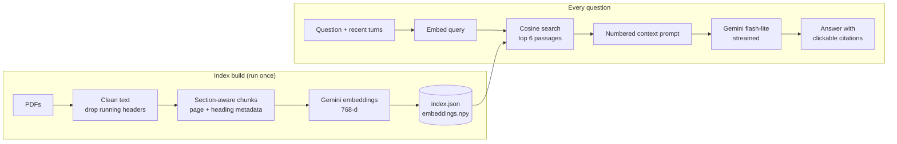

# 🌿 AyurIP Sahayak

**A retrieval-augmented (RAG) research assistant for Ayurveda, Traditional Knowledge and Intellectual Property Rights.** Ask a question in English, Hindi or Hinglish; get a streamed answer where every claim cites the exact page it came from.

[](https://github.com/rudraksh01-tech/AyurIP-Sahayak/actions/workflows/ci.yml)

**Live demo:** _add your Vercel URL here after deploying (see [Deploy for free](#-deploy-for-free-on-vercel))_


---

## ✨ Features

- **Cited answers.** Every statement links to a numbered source; clicking `[2]` opens the passage with its document, page number and section heading.
- **Streaming.** The first words appear in about 3 seconds; sources show up after about 1 second, before the answer is written.
- **English, Hindi and Hinglish.** Multilingual embeddings retrieve English passages for Hindi questions, and the answer comes back in the question's language.
- **Follow-up questions.** Recent turns are sent with each question, so "and what about neem?" works.
- **Measured retrieval.** An evaluation harness compares three retrievers on 33 labelled questions (see [results](#-retrieval-evaluation)).
- **Production basics.** Input validation, per-visitor rate limiting to protect the free API quota, clear error messages, 39 tests, CI, and a one-click free deployment.

<p align="center">
  
  &nbsp;
  
</p>

---

## 🧠 How it works


```mermaid
flowchart LR
    subgraph Build["Index build (run once)"]
        A[PDFs] --> B[Clean text<br/>drop running headers]
        B --> C[Section-aware chunks<br/>page + heading metadata]
        C --> D[Gemini embeddings<br/>768-d]
        D --> E[(index.json<br/>embeddings.npy)]
    end

    subgraph Ask["Every question"]
        Q[Question + recent turns] --> F[Embed query]
        F --> G[Cosine search<br/>top 6 passages]
        E --> G
        G --> H[Numbered context prompt]
        H --> I[Gemini flash-lite<br/>streamed]
        I --> J[Answer with<br/>clickable citations]
    end
```

1. **Ingestion** (`backend/rag/ingestion/`): text is extracted page by page with `pypdf`. Lines that repeat on most pages (journal headers, "425 | Page" footers) are removed automatically. Section headings such as `3.5 How TKDL Helps Prevent Wrongful Patent Claims` are detected and attached to every chunk. Chunks are packed from whole sentences (up to 1,000 characters, overlapping by about 150), never cross a page boundary, and skip bibliographies.
2. **Embedding**: each chunk is embedded with `gemini-embedding-001` (task type `RETRIEVAL_DOCUMENT`, with the document title and section heading as context) and stored as a normalised `float32` matrix of about 0.7 MB.
3. **Retrieval** (`backend/rag/retrieval/`): the question is embedded (`RETRIEVAL_QUERY`) and matched by cosine similarity. BM25 and a hybrid BM25 + embeddings mode (Reciprocal Rank Fusion) are also implemented and evaluated.
4. **Generation** (`backend/rag/generation/`): the top 6 passages are numbered and sent to Gemini with instructions to answer only from them, cite as `[n]`, and reply in the user's language. The answer streams to the browser as newline-delimited JSON.

---

## 📊 Retrieval evaluation

`backend/eval/questions.json` holds 33 questions, each labelled with the knowledge-base sections that answer it: 24 general questions, 4 in Hindi or Hinglish, and 5 exact-identifier queries such as patent numbers and "Section 3(p)". A hit means a passage from a correct section is in the top k.

| Retriever | Hit@1 | Hit@3 | Hit@6 | MRR |
|---|---|---|---|---|
| **Dense (Gemini embeddings)** | **0.97** | **1.00** | **1.00** | **0.98** |
| Hybrid (BM25 + dense, RRF) | 0.88 | 1.00 | 1.00 | 0.93 |
| BM25 (keywords) | 0.52 | 0.76 | 0.91 | 0.66 |

By question type (MRR):

| Retriever | General (24) | Hindi/Hinglish (4) | Identifiers (5) |
|---|---|---|---|
| Dense | 0.98 | 1.00 | 1.00 |
| Hybrid | 0.95 | 1.00 | 0.80 |
| BM25 | 0.72 | 0.25 | 0.67 |

**Decision:** dense retrieval is the default. Hybrid search is often recommended for exact terms, but on this corpus Gemini embeddings already rank patent numbers and statute sections first, and fusing in BM25 only pushed correct passages from rank 1 to rank 2 or 3. BM25 cannot match Hindi questions against English documents at all. `RETRIEVAL_MODE=hybrid` switches modes; re-run the evaluation whenever the documents change.

```bash
python -m backend.eval.evaluate
```

---

## 🛠️ Tech stack

| Layer | Tools |
|---|---|
| Frontend | React 19, Vite, `react-markdown`, plain CSS with light/dark themes |
| Backend | Python 3.12, FastAPI, streaming NDJSON responses |
| AI | Gemini API: `gemini-embedding-001` for retrieval, `gemini-3.5-flash-lite` for answers |
| Retrieval | NumPy cosine search, BM25 and RRF implemented from scratch |
| Quality | pytest (39 tests), ESLint, GitHub Actions CI, retrieval evaluation harness |
| Hosting | Vercel (frontend and API from one deployment, free Hobby plan) |

---

## 📂 Project structure

```text
AyurIP-Sahayak/
├── backend/
│   ├── app/main.py              # FastAPI app: /api/health, /api/ask, /api/ask/stream
│   ├── rag/
│   │   ├── config.py            # models, paths, retrieval settings
│   │   ├── gemini_client.py     # embeddings + streamed generation
│   │   ├── ingestion/           # PDF cleaning, chunking, build_index.py
│   │   ├── retrieval/           # dense / BM25 / hybrid retriever
│   │   ├── generation/          # prompt + citation parsing
│   │   └── rag_pipeline.py      # retrieval -> generation -> events
│   ├── data/
│   │   ├── raw/                 # source PDFs + sources.json (titles)
│   │   └── processed/           # index.json + embeddings.npy
│   ├── eval/                    # labelled questions + evaluate.py
│   └── tests/
├── frontend/                    # React + Vite chat UI
├── pyproject.toml               # runtime deps + Vercel entrypoint
├── requirements.txt             # same runtime deps, for pip
├── requirements-dev.txt         # + pypdf, pytest
└── vercel.json
```

---

## ⚙️ Run locally

You need Python 3.12+, Node.js 22+ and a free Gemini API key from [Google AI Studio](https://aistudio.google.com/apikey).

```bash
git clone https://github.com/rudraksh01-tech/AyurIP-Sahayak.git
cd AyurIP-Sahayak

# Backend
python -m venv .venv
# Windows: .\.venv\Scripts\Activate.ps1    macOS/Linux: source .venv/bin/activate
pip install -r requirements-dev.txt

cp .env.example .env        # Windows: copy .env.example .env
# then put your key in .env: GEMINI_API_KEY=...

uvicorn backend.app.main:app --reload --port 8001
```

In a second terminal:

```bash
cd frontend
npm install
npm run dev                 # http://localhost:5173 (proxies /api to port 8001)
```

To try the production setup instead, run `npm run build` in `frontend/`; FastAPI then serves the built app at http://127.0.0.1:8001.

### Rebuild the knowledge base

Put PDFs in `backend/data/raw/`, optionally add their titles to `sources.json`, then:

```bash
python -m backend.rag.ingestion.build_index --dry-run   # preview chunks, no API calls
python -m backend.rag.ingestion.build_index             # chunk + embed
```

### Tests

```bash
pytest                        # backend (no API key needed)
cd frontend && npm run lint   # frontend
```

---

## 🚀 Deploy for free on Vercel

The whole app (React build and FastAPI API) deploys as one Vercel project on the free Hobby plan. `pyproject.toml` tells Vercel where the FastAPI app is, `vercel.json` builds the frontend, and FastAPI serves it from the same domain, so no CORS setup is needed.

1. Push this repository to GitHub.
2. Go to [vercel.com/new](https://vercel.com/new), sign in with GitHub and import the repository. Keep the root directory as the project root; Vercel should detect **FastAPI**.
3. Under **Environment Variables**, add `GEMINI_API_KEY` (the free-tier key is enough).
4. Click **Deploy**. Open the URL and ask a question.

> Use an API key from a Google Cloud project **without billing enabled**. Then a public demo can hit the free-tier limit at worst; it can never cost money. The app also limits each visitor to 10 questions per minute.

---

## 🔌 API

| Method | Path | Description |
|---|---|---|
| `GET` | `/api/health` | Status, model name and knowledge-base stats |
| `POST` | `/api/ask` | `{"question": "...", "history": [...]}` → full answer, sources, timings |
| `POST` | `/api/ask/stream` | Same input; streams NDJSON events: `sources`, `delta` (repeated), `done` |

Interactive docs are available at `/docs` when the server is running.

## 🔧 Configuration

| Variable | Default | Purpose |
|---|---|---|
| `GEMINI_API_KEY` | (required) | Gemini API key |
| `GEMINI_MODEL` | `gemini-3.5-flash-lite` | Answer model (`gemini-3.6-flash` is more capable but about 3× slower) |
| `GEMINI_THINKING_LEVEL` | `minimal` | `minimal`, `low`, `medium` or `high` |
| `RETRIEVAL_MODE` | `dense` | `dense`, `hybrid` or `bm25` |
| `RATE_LIMIT_PER_MINUTE` | `10` | Questions per visitor per minute |

---

## 🧭 Limitations and next steps

- The knowledge base is two documents (54 pages). Adding sources such as WIPO and CGPDTM documents is mostly a matter of dropping PDFs in and re-running `build_index`.
- The rate limiter is in memory, so each serverless instance counts separately. A shared store such as Redis or Upstash would make it global.
- Retrieval is evaluated; answer quality (faithfulness, citation accuracy) is not yet. An LLM-as-judge evaluation is the natural next step.
- The journal PDF uses two columns, so some of its section labels are approximate. Page numbers are exact.

---

## 👨‍💻 Author

**Rudra Pratap Singh**

## 📄 License

For educational and research purposes. The answers are informational and are not legal or medical advice.
