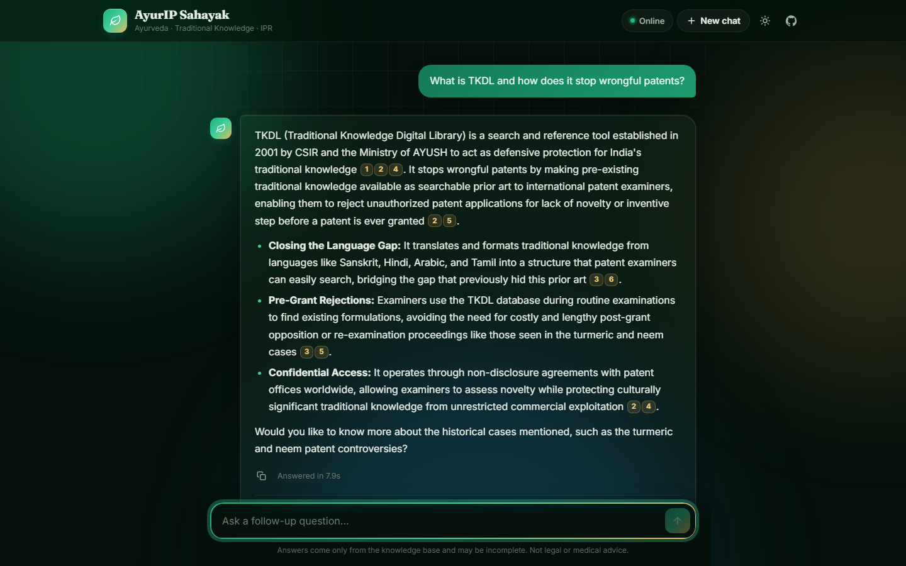
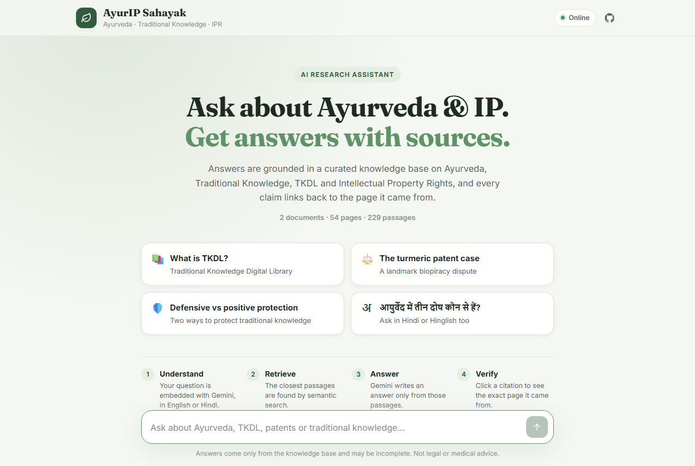
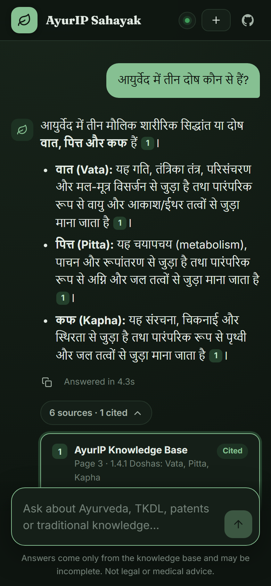
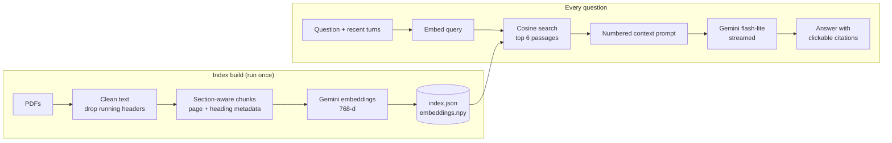

<div align="center">

# 🌿 AyurIP-Sahayak

### AI-Powered RAG Assistant for Ayurveda, Traditional Knowledge & Intellectual Property Research

**Retrieve first → Generate second.**

[](https://github.com/rudraksh01-tech/AyurIP-Sahayak/actions/workflows/ci.yml)
[](https://www.python.org/)
[](https://fastapi.tiangolo.com/)
[](https://react.dev/)
[](https://vitejs.dev/)
[](https://ai.google.dev/)
[](#-how-it-works)

### 🔗 [Live demo → ayur-ip-sahayak.vercel.app](https://ayur-ip-sahayak.vercel.app)

</div>

Ask a question in English, Hindi or Hinglish and get a streamed answer where every claim cites the exact page it came from.



---

## ✨ Features

- **Cited answers.** Every statement links to a numbered source; clicking `[2]` opens the passage with its document, page number and section heading.
- **Streaming.** The first words appear in about 3 seconds; sources show up after about 1 second, before the answer is written.
- **English, Hindi and Hinglish.** Multilingual embeddings retrieve English passages for Hindi questions, and the answer comes back in the question's language.
- **Follow-up questions.** Recent turns are sent with each question, so "and what about neem?" works.
- **Topic explorer.** Six topic cards (Ayurveda foundations, TKDL, patent law, landmark cases, global frameworks, prior-art search) each offer questions the knowledge base is known to answer.
- **Polished interface.** Glassmorphism cards over an emerald-and-gold palette, a light/dark theme toggle that remembers your choice, and a layout that works down to phone width.
- **Measured retrieval.** An evaluation harness compares three retrievers on 33 labelled questions (see [results](#-retrieval-evaluation)).
- **Production basics.** Input validation, per-visitor rate limiting to protect the free API quota, clear error messages, 39 tests, CI, and a one-click free deployment.

<p align="center">
  
  &nbsp;
  
</p>

---

## 🎯 Why I Built This

Information related to Ayurveda, Traditional Knowledge and IPR is often spread across lengthy documents.

This creates practical problems:

* Large documents can be difficult to search manually.
* Keyword search may fail when the same concept is expressed differently.
* Important information can be buried inside long documents.
* A general-purpose LLM may not have access to the project's specific documents.
* Users need a simpler way to interact with domain-specific information.

AyurIP-Sahayak explores how **RAG can be used to solve this problem**.

---

## 🧠 How it works

The project is intentionally **not** just `React → Gemini API → Answer`. It searches its own knowledge base first, then uses the LLM to explain what it found, and shows where every claim came from.


```mermaid
flowchart LR
    subgraph Build["Index build (run once)"]
        A[PDFs] --> B[Clean text<br/>drop running headers]
        B --> C[Section-aware chunks<br/>page + heading metadata]
        C --> D[Gemini embeddings<br/>768-d]
        D --> E[(index.json<br/>embeddings.npy)]
    end

    subgraph Ask["Every question"]
        Q[Question + recent turns] --> F[Embed query]
        F --> G[Cosine search<br/>top 6 passages]
        E --> G
        G --> H[Numbered context prompt]
        H --> I[Gemini flash-lite<br/>streamed]
        I --> J[Answer with<br/>clickable citations]
    end
```

1. **Ingestion** (`backend/rag/ingestion/`): text is extracted page by page with `pypdf`. Lines that repeat on most pages (journal headers, "425 | Page" footers) are removed automatically. Section headings such as `3.5 How TKDL Helps Prevent Wrongful Patent Claims` are detected and attached to every chunk. Chunks are packed from whole sentences (up to 1,000 characters, overlapping by about 150), never cross a page boundary, and skip bibliographies.
2. **Embedding**: each chunk is embedded with `gemini-embedding-001` (task type `RETRIEVAL_DOCUMENT`, with the document title and section heading as context) and stored as a normalised `float32` matrix of about 0.7 MB.
3. **Retrieval** (`backend/rag/retrieval/`): the question is embedded (`RETRIEVAL_QUERY`) and matched by cosine similarity. BM25 and a hybrid BM25 + embeddings mode (Reciprocal Rank Fusion) are also implemented and evaluated.
4. **Generation** (`backend/rag/generation/`): the top 6 passages are numbered and sent to Gemini with instructions to answer only from them, cite as `[n]`, and reply in the user's language. The answer streams to the browser as newline-delimited JSON.

Retrieval and generation stay separate components, so either can change without touching the other.

---

## 📊 Retrieval evaluation

`backend/eval/questions.json` holds 33 questions, each labelled with the knowledge-base sections that answer it: 24 general questions, 4 in Hindi or Hinglish, and 5 exact-identifier queries such as patent numbers and "Section 3(p)". A hit means a passage from a correct section is in the top k.

| Retriever | Hit@1 | Hit@3 | Hit@6 | MRR |
|---|---|---|---|---|
| **Dense (Gemini embeddings)** | **0.97** | **1.00** | **1.00** | **0.98** |
| Hybrid (BM25 + dense, RRF) | 0.88 | 1.00 | 1.00 | 0.93 |
| BM25 (keywords) | 0.52 | 0.76 | 0.91 | 0.66 |

By question type (MRR):

| Retriever | General (24) | Hindi/Hinglish (4) | Identifiers (5) |
|---|---|---|---|
| Dense | 0.98 | 1.00 | 1.00 |
| Hybrid | 0.95 | 1.00 | 0.80 |
| BM25 | 0.72 | 0.25 | 0.67 |

**Decision:** dense retrieval is the default. Hybrid search is often recommended for exact terms, but on this corpus Gemini embeddings already rank patent numbers and statute sections first, and fusing in BM25 only pushed correct passages from rank 1 to rank 2 or 3. BM25 cannot match Hindi questions against English documents at all. `RETRIEVAL_MODE=hybrid` switches modes; re-run the evaluation whenever the documents change.

```bash
python -m backend.eval.evaluate
```

---

## 🛠️ Engineering Challenges & Solutions

### Challenge 1 — Deployment memory

**Problem.** The first version embedded text locally with `sentence-transformers` (`all-MiniLM-L6-v2`). A Render deployment was attempted, but the free instance exceeded its **512 MiB memory limit**; PyTorch, Transformers and sentence-transformers were the main contributors. On Windows, Smart App Control also blocked PyTorch's DLLs, so the backend could not start locally either.

**Solution.** Move embeddings to the Gemini embeddings API and do the vector search with NumPy. The runtime dependencies shrank to FastAPI, `google-genai`, NumPy and `python-dotenv`, the index went from a 3 MB JSON file to a 0.7 MB `.npy` matrix, and the whole app now fits Vercel's free tier.

> **Deployment constraints are not only about application logic; the runtime footprint of AI dependencies also matters.**

### Challenge 2 — Choosing a retriever with evidence

**Problem.** Hybrid (keyword + semantic) search is a common recommendation, but it was unclear whether it would help here.

**Solution.** Build a labelled evaluation set and measure all three options. Dense retrieval won (MRR 0.98 vs 0.93 hybrid), so it is the default and the others remain as baselines.

### Challenge 3 — Slow answers

**Problem.** `gemini-3.6-flash` took about 10–13 seconds per answer, which feels broken in a chat UI.

**Solution.** Stream answers token by token as NDJSON, send the sources before generation starts, and benchmark models: `gemini-3.5-flash-lite` with minimal thinking shows the first words in about 3 seconds with the same answer quality on this task.

### Challenge 4 — Trustworthy answers

**Problem.** An LLM answer is hard to trust if you cannot see where it came from.

**Solution.** Number the retrieved passages, instruct the model to cite them as `[n]`, parse the citations, and render them as chips that open the exact page and section.

### Challenge 5 — Keeping secrets safe on a public demo

**Problem.** A public demo must not leak the API key or let one visitor exhaust the free quota.

**Solution.** The key lives only in server-side environment variables (`.env` locally, Vercel settings in production) and is never sent to the browser. Each visitor is limited to 10 questions per minute, and inputs are validated.

---

## 💻 Tech stack

| Layer | Tools |
|---|---|
| Frontend | React 19, Vite, `react-markdown`, hand-written CSS design system (tokens, glassmorphism, light/dark) |
| Backend | Python 3.12, FastAPI, streaming NDJSON responses |
| AI | Gemini API: `gemini-embedding-001` for retrieval, `gemini-3.5-flash-lite` for answers |
| Retrieval | NumPy cosine search, BM25 and RRF implemented from scratch |
| Documents | `pypdf` text extraction, custom section-aware chunking |
| Quality | pytest (39 tests), ESLint, GitHub Actions CI, retrieval evaluation harness |
| Hosting | Vercel (frontend and API from one deployment, free Hobby plan) |

---

## 📂 Project structure

```text
AyurIP-Sahayak/
├── backend/
│   ├── app/main.py              # FastAPI app: /api/health, /api/ask, /api/ask/stream
│   ├── rag/
│   │   ├── config.py            # models, paths, retrieval settings
│   │   ├── gemini_client.py     # embeddings + streamed generation
│   │   ├── ingestion/           # PDF cleaning, chunking, build_index.py
│   │   ├── retrieval/           # dense / BM25 / hybrid retriever
│   │   ├── generation/          # prompt + citation parsing
│   │   └── rag_pipeline.py      # retrieval -> generation -> events
│   ├── data/
│   │   ├── raw/                 # source PDFs + sources.json (titles)
│   │   └── processed/           # index.json + embeddings.npy
│   ├── eval/                    # labelled questions + evaluate.py
│   └── tests/
├── frontend/                    # React + Vite chat UI
├── pyproject.toml               # runtime deps + Vercel entrypoint
├── requirements.txt             # same runtime deps, for pip
├── requirements-dev.txt         # + pypdf, pytest
└── vercel.json
```

---

## ⚙️ Run locally

You need Python 3.12+, Node.js 22+ and a free Gemini API key from [Google AI Studio](https://aistudio.google.com/apikey).

```bash
git clone https://github.com/rudraksh01-tech/AyurIP-Sahayak.git
cd AyurIP-Sahayak

# Backend
python -m venv .venv
# Windows: .\.venv\Scripts\Activate.ps1    macOS/Linux: source .venv/bin/activate
pip install -r requirements-dev.txt

cp .env.example .env        # Windows: copy .env.example .env
# then put your key in .env: GEMINI_API_KEY=...

uvicorn backend.app.main:app --reload --port 8001
```

In a second terminal:

```bash
cd frontend
npm install
npm run dev                 # http://localhost:5173 (proxies /api to port 8001)
```

To try the production setup instead, run `npm run build` in `frontend/`; FastAPI then serves the built app at http://127.0.0.1:8001.

### Rebuild the knowledge base

Put PDFs in `backend/data/raw/`, optionally add their titles to `sources.json`, then:

```bash
python -m backend.rag.ingestion.build_index --dry-run   # preview chunks, no API calls
python -m backend.rag.ingestion.build_index             # chunk + embed
```

### Tests

```bash
pytest                        # backend (no API key needed)
cd frontend && npm run lint   # frontend
```

---

## 🚀 Deploy for free on Vercel

The whole app (React build and FastAPI API) deploys as one Vercel project on the free Hobby plan. `pyproject.toml` tells Vercel where the FastAPI app is, `vercel.json` builds the frontend, and FastAPI serves it from the same domain, so no CORS setup is needed.

1. Push this repository to GitHub.
2. Go to [vercel.com/new](https://vercel.com/new), sign in with GitHub and import the repository. Keep the root directory as the project root; Vercel should detect **FastAPI**.
3. Under **Environment Variables**, add `GEMINI_API_KEY` (the free-tier key is enough).
4. Click **Deploy**. Open the URL and ask a question.

> Use an API key from a Google Cloud project **without billing enabled**. Then a public demo can hit the free-tier limit at worst; it can never cost money. The app also limits each visitor to 10 questions per minute.

---

## 🔌 API

| Method | Path | Description |
|---|---|---|
| `GET` | `/api/health` | Status, model name and knowledge-base stats |
| `POST` | `/api/ask` | `{"question": "...", "history": [...]}` → full answer, sources, timings |
| `POST` | `/api/ask/stream` | Same input; streams NDJSON events: `sources`, `delta` (repeated), `done` |

Interactive docs are available at `/docs` when the server is running.

## 🔧 Configuration

| Variable | Default | Purpose |
|---|---|---|
| `GEMINI_API_KEY` | (required) | Gemini API key |
| `GEMINI_MODEL` | `gemini-3.5-flash-lite` | Answer model (`gemini-3.6-flash` is more capable but about 3× slower) |
| `GEMINI_THINKING_LEVEL` | `minimal` | `minimal`, `low`, `medium` or `high` |
| `RETRIEVAL_MODE` | `dense` | `dense`, `hybrid` or `bm25` |
| `RATE_LIMIT_PER_MINUTE` | `10` | Questions per visitor per minute |

---

## 🚀 Roadmap

### Phase 1 — Core RAG

* [x] Document ingestion and text extraction
* [x] Chunking
* [x] Embedding generation
* [x] Semantic retrieval
* [x] Gemini generation
* [x] FastAPI backend
* [x] React frontend

### Phase 2 — RAG quality

* [x] Retrieval evaluation (Hit@k, MRR)
* [x] Section-aware chunking with page metadata
* [x] Improved source attribution (inline citations → page + section)
* [ ] Reranking
* [ ] Query rewriting for follow-up questions

### Phase 3 — Multilingual

* [x] Hindi and Hinglish queries
* [x] Multilingual retrieval
* [x] Answers in the question's language
* [ ] More Indian languages

### Phase 4 — Production

* [x] Lightweight embedding service (Gemini API instead of local PyTorch)
* [x] Free deployment setup (Vercel)
* [x] Follow-up questions within a chat session
* [x] Rate limiting, tests and CI
* [ ] Vector database for a larger knowledge base
* [ ] Authentication and saved conversations
* [ ] Monitoring

### Phase 5 — Advanced RAG

* [x] Hybrid search (implemented and evaluated; dense kept as default)
* [ ] Metadata filtering
* [ ] Reranking models
* [ ] Answer-quality evaluation (faithfulness, citation accuracy)
* [ ] Evaluation dashboard

---

## 🧠 Skills demonstrated

**AI / Machine Learning:** Retrieval-Augmented Generation, semantic search, text embeddings, vector similarity, BM25 and rank fusion, retrieval evaluation (Hit@k, MRR), prompt design for grounded and cited answers, multilingual QA.

**Backend:** Python, FastAPI, REST and streaming APIs, input validation, rate limiting, modular architecture, pytest.

**Frontend:** React, Vite, streaming UI, API integration, state management, responsive and dark-mode design.

**Engineering:** Git/GitHub, GitHub Actions CI, dependency management, debugging, deployment troubleshooting, resource optimisation, architecture decisions backed by measurements.

---

## ⚠️ Limitations

- The knowledge base is two documents (54 pages). Adding sources such as WIPO and CGPDTM documents is mostly a matter of dropping PDFs in and re-running `build_index`.
- If the right passage is not retrieved, the answer will be incomplete; the app says so instead of guessing, but it cannot answer beyond its documents.
- The rate limiter is in memory, so each serverless instance counts separately. A shared store such as Redis or Upstash would make it global.
- Retrieval is evaluated; answer quality (faithfulness, citation accuracy) is not yet.
- The journal PDF uses two columns, so some of its section labels are approximate. Page numbers are exact.

---

## 👨‍💻 About the Developer

### Rudra Pratap Singh

**AyurIP-Sahayak** is an independently developed personal project created from scratch to explore and implement **Retrieval-Augmented Generation for domain-specific knowledge discovery**.

The goal was not simply to call a chatbot API, but to understand and implement the major components of a RAG system:

```text
Documents → Embeddings → Retrieval → Context → LLM → Application
```

---

## ⚖️ Disclaimer

AyurIP-Sahayak is an experimental/research-oriented software project.

Information generated by the system should not be treated as a substitute for professional:

* Legal advice
* Patent advice
* Medical advice
* Ayurvedic consultation

Important information should be independently verified using authoritative sources and qualified professionals.

---

## 📄 License

This project is currently intended as a personal/research portfolio project.

A formal open-source license can be added when the repository's licensing terms are finalized.

---

<div align="center">

### 🌿 AyurIP-Sahayak

**Retrieve first. Generate second.**

Built to explore real-world **RAG architecture, semantic retrieval, LLM integration, and full-stack AI engineering.**

</div>
